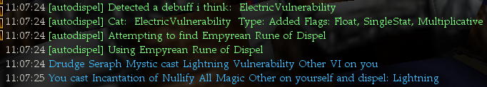

# overview
This UtilityBelt based LUA script attempts to automatically dispel any debuffs by using Sundering's custom "Empyrean Rune of Dispel"

# known issues

- Script expects the user to have an "Empyrean Rune of Dispel" in their inventory
- On rare occassions, the script does not fire on some debuffs.  Looking into this.

